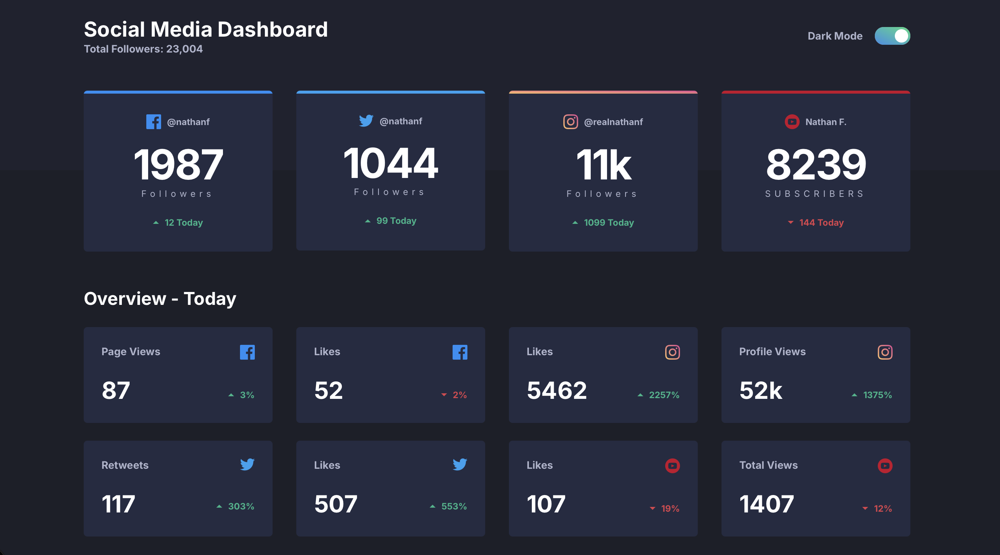
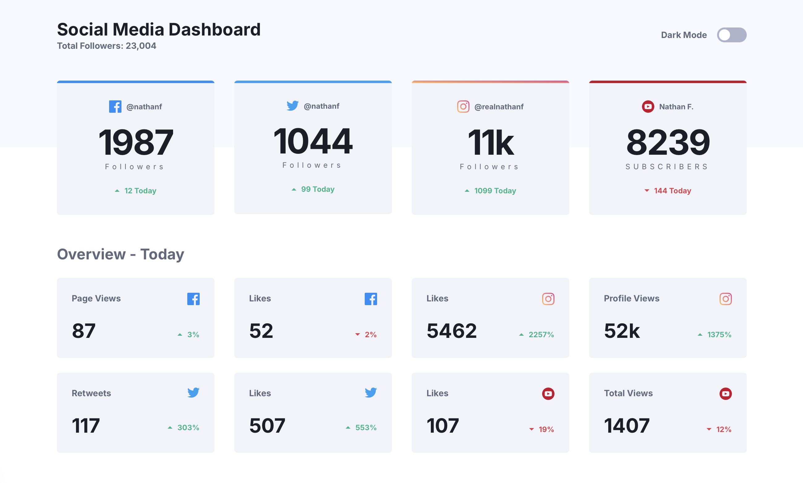

# Frontend Mentor - Social media dashboard with theme switcher solution

This is a solution to the [Social media dashboard with theme switcher challenge on Frontend Mentor](https://www.frontendmentor.io/challenges/social-media-dashboard-with-theme-switcher-6oY8ozp_H).
It is a responsive social media dashboard with a light and dark theme. It shows a total follower count, four platform cards (Facebook, Twitter, Instagram, YouTube), and an “Overview - Today” grid of engagement stats.

## Table of contents

- [Overview](#overview)
  - [The challenge](#the-challenge)
  - [Screenshot](#screenshot)
  - [Links](#links)
- [Getting started](#getting-started)
  - [Install and run](#install-and-run)
  - [Folder structure](#folder-structure)
  - [Edit the numbers](#edit-the-numbers)
- [My process](#my-process)
  - [Built with](#built-with)
  - [Theme toggle](#theme-toggle)
  - [Breakpoints](#breakpoints)
  - [What I learned](#what-i-learned)
  - [Continued development](#continued-development)
  - [Useful resources](#useful-resources)
  - [AI Collaboration](#ai-collaboration)
- [Author](#author)
- [Acknowledgments](#acknowledgments)

## Overview

### The challenge

Users should be able to:

- View the optimal layout for the site depending on their device's screen size
- See hover states for all interactive elements on the page
- Toggle color theme to their preference

All three are covered:

- **Responsive layout** – mobile-first, with dedicated tablet and desktop layouts (see [Breakpoints](#breakpoints)).
- **Hover states** – every card changes background on hover, and the theme switch shows a visible focus ring for keyboard users.
- **Theme switching** – a “Dark Mode” switch that follows the system preference on first visit and remembers the user's choice (see [Theme toggle](#theme-toggle)).

### Screenshot




### Links

- Solution URL: [Add solution URL here](https://your-solution-url.com)
- Live Site URL: [Add live site URL here](https://your-live-site-url.com)

## Getting started

### Install and run

Requires Node.js 20.9 or later.

```bash
npm install
npm run dev
```

Open [http://localhost:3000](http://localhost:3000).

Other scripts:

```bash
npm run lint    # ESLint, fails on any warning
npm run build   # production build
npm run start   # serve the production build
```

### Folder structure

```text
src/
  app/            layout, page, and global styles
  components/     ThemeToggle, Header, FollowerCard, StatCard, TotalFollowers, OverviewSection
  data/           dashboard-data.ts
  lib/            number formatting helpers
  types/          shared dashboard types
public/icons/     local SVG icons
```

`ThemeProvider`, `PlatformIcon`, and `TrendChange` are small supporting components. `ThemeProvider` is the client boundary `next-themes` needs. Icons and trend arrows are shared by the follower and overview cards.

### Edit the numbers

All card content lives in `src/data/dashboard-data.ts`. Change a count, handle, label, or `trend` (`"up"` or `"down"`) and the page re-renders from that file.

- Values of 10,000 and above display as thousands (`11000` → `11k`, `52000` → `52k`).
- The header total uses grouped digits (`23004` → `23,004`).

## My process

### Built with

- Mobile-first workflow
- [React](https://react.dev/) - JS library
- [Next.js](https://nextjs.org/) (App Router) - React framework
- [TypeScript](https://www.typescriptlang.org/) - typed JavaScript
- [Tailwind CSS v4](https://tailwindcss.com/) - utility-first styling
- [`next/font/google`](https://nextjs.org/docs/app/api-reference/components/font) - loads Inter, the design font (it was not included in the local asset folder)
- [next-themes](https://github.com/pacocoursey/next-themes) - class-based light and dark mode
- [Prettier](https://prettier.io/) with `prettier-plugin-tailwindcss`, and [ESLint](https://eslint.org/)

### Theme toggle

The switch is labeled “Dark Mode”. On means dark mode (gradient track, knob on the right). Off means light mode (gray track, knob on the left). The first visit follows the system preference, and the choice is saved in `localStorage`. `next-themes` sets the `class` on `<html>` before paint, with `suppressHydrationWarning`, so the wrong theme does not flash on load.

The switch is a `<button role="switch">` with `aria-checked`, so screen readers announce it as an on/off control.

### Breakpoints

Layout is mobile-first:

- Up to 767px: one column of follower cards and one column of overview cards.
- 768px to 1023px (`md`): follower cards in a 2×2 grid and overview cards in 2 columns. The column is 542px wide, matching the tablet frame, and stays centered as the viewport grows.
- 1024px and up (`lg`): four follower cards and four overview cards per row, in a centered container up to 1116px wide.

Hover styles use Tailwind’s default `hover` variant, which only applies when the device supports hover. Color changes respect `prefers-reduced-motion`.

### What I learned

**Theming with CSS variables and Tailwind v4.** Each theme defines the same set of variables, and `@theme inline` maps them to Tailwind colors. Components use one class name (`bg-card`, `text-text-primary`) and the theme decides the value:

```css
:root {
  --card: #f1f3fa;
  --text-primary: #1d1f29;
}

.dark {
  --card: #252b42;
  --text-primary: #ffffff;
}

@theme inline {
  --color-card: var(--card);
  --color-text-primary: var(--text-primary);
}
```

**Avoiding hydration mismatches.** The saved theme is only known in the browser, so the toggle waits until it has mounted before reporting its checked state. That keeps the server HTML and the first client render identical:

```tsx
const [mounted, setMounted] = useState(false);

useEffect(() => {
  setMounted(true);
}, []);

<button role="switch" aria-checked={mounted ? isDark : false} />;
```

**Formatting numbers in one place.** Keeping display rules in a helper means the data file holds raw numbers only:

```ts
export function formatCount(value: number): string {
  const absolute = Math.abs(value);

  if (absolute >= 10000) {
    const scaled = absolute / 1000;
    const compact = Number.isInteger(scaled)
      ? String(scaled)
      : scaled.toFixed(1).replace(/\.0$/, "");

    return value < 0 ? `-${compact}k` : `${compact}k`;
  }

  return String(value);
}
```

### Continued development

- Add unit tests for the formatting helpers and component tests for the theme toggle.
- Load dashboard data from an API instead of a static file, with loading and error states.
- Keep improving accessibility checks (contrast in both themes, screen reader testing).

### Useful resources

- [Next.js documentation](https://nextjs.org/docs) - App Router layouts, fonts, and client components.
- [Tailwind CSS v4 – Theme variables](https://tailwindcss.com/docs/theme) - how `@theme` turns CSS variables into utility classes.
- [Tailwind CSS – Dark mode](https://tailwindcss.com/docs/dark-mode) - setting up a class-based `dark` variant.
- [next-themes](https://github.com/pacocoursey/next-themes) - theme persistence and avoiding the flash of the wrong theme.
- [WAI-ARIA Switch pattern](https://www.w3.org/WAI/ARIA/apg/patterns/switch/) - the accessible markup for the theme toggle.

### AI Collaboration

- **Tools:** Claude (via Claude Code in PyCharm).
- **How I used it:** Reviewing my code bugs, explaining some of the bugs I couldn't understand, and organizing my file structure for a better README.
- **What worked well / what didn't:** _Successfully identified my code bugs. But I couldn't understand why the theme toggle wasn't working properly, So I had to review myself._

## Author

- Website - [Joke wizzo](https://www.wizzoviz.tech/)
- Twitter - [Stillwizzo](https://x.com/stillwizzo)
- LinkedIn - [Kuach John](https://www.linkedin.com/in/kuach-john-565ab62aa/)
- Frontend Mentor - [Kuach-joke](https://www.frontendmentor.io/profile/Kuach-joke)

## Acknowledgments

Thanks to [Frontend Mentor](https://www.frontendmentor.io/) for the challenge design and assets.
